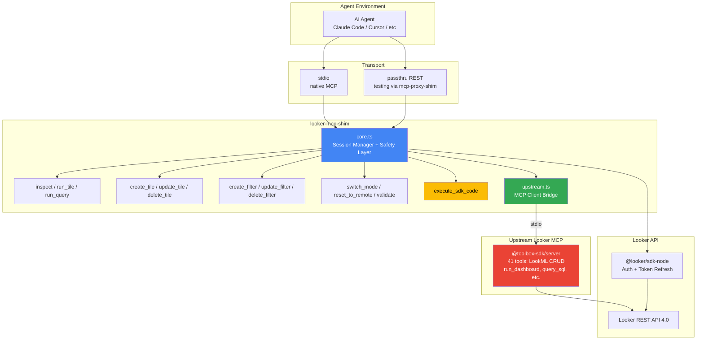
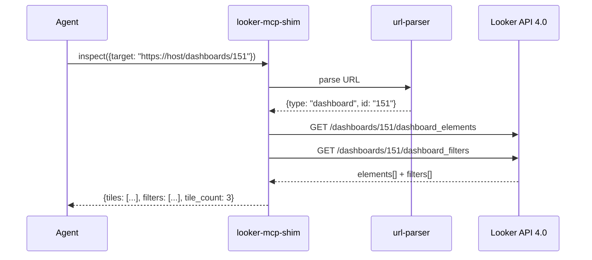
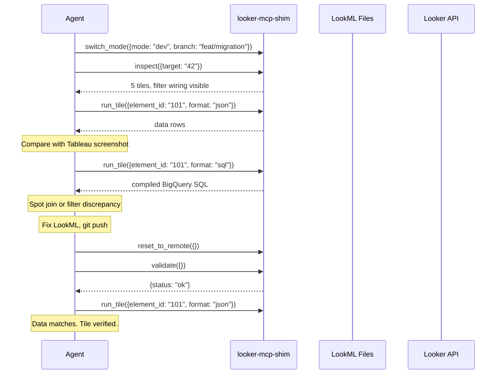
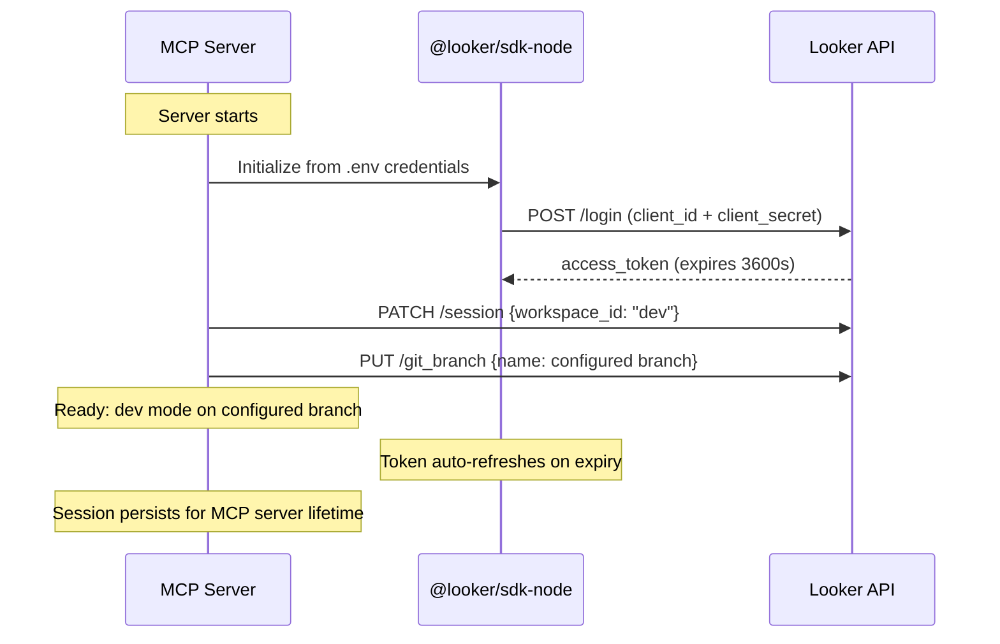

# @luutuankiet/looker-mcp-shim

**An MCP server that gives AI agents first-class Looker development capabilities.**

Tile-level dashboard inspection, per-tile compiled SQL, programmatic git sync, dev/prod mode switching, and a code execution escape hatch for arbitrary Looker SDK calls — all through the [Model Context Protocol](https://modelcontextprotocol.io).

```bash
npx -y @luutuankiet/looker-mcp-shim
```

## Why This Exists

Google's upstream [Looker MCP](https://github.com/GoogleCloudPlatform/looker-mcp) (`@toolbox-sdk/server`) provides basic operations — dev mode toggle, file read/write, `run_dashboard`. But AI agents doing real Looker development (migration QA, LookML refactoring, dashboard debugging) need **tile-level granularity**:

| What the Agent Needs | Upstream Looker MCP | This Shim |
|---------------------|--------------------|-----------|
| Per-tile metadata (fields, explore, filters, sorts) | ❌ `run_dashboard` returns data only | ✅ `inspect` |
| Per-tile compiled SQL | ❌ Needs explore+fields upfront | ✅ `run_tile --format sql` |
| Filter wiring (which filters → which tiles) | ❌ Not exposed | ✅ `inspect` tile detail |
| Reset to remote git state | ❌ Workaround only | ✅ `reset_to_remote` |
| Dev mode + branch as atomic init | ❌ Separate calls | ✅ `switch_mode` |
| Arbitrary SDK calls | ❌ Fixed tool set | ✅ `execute_sdk_code` |
| Create/update/delete tiles | ❌ Not available | ✅ `create_tile`, `update_tile`, `delete_tile` |
| Create/update/delete filters | ❌ Not available | ✅ `create_filter`, `update_filter`, `delete_filter` |

Starting with v0.2.0, this shim **automatically bridges** the upstream Looker MCP — one server, all tools. No need to register two servers.

## Architecture



**One server, 54 tools.** The shim spawns `@toolbox-sdk/server` as a child process, connects via MCP client, discovers all upstream tools, and merges them with our custom tools. Shim tools take priority on name collisions. If upstream is unavailable, the 13 shim tools still work independently.

Disable upstream: `SKIP_UPSTREAM=1 npx @luutuankiet/looker-mcp-shim`

## Quickstart

### 1. Install

```bash
npm install -g @luutuankiet/looker-mcp-shim
# or run directly
npx -y @luutuankiet/looker-mcp-shim
```

### 2. Configure

Create a `.env` file in your project root:

```bash
LOOKER_BASE_URL=https://your-instance.cloud.looker.com
LOOKER_CLIENT_ID=your_client_id
LOOKER_CLIENT_SECRET=your_client_secret
LOOKER_PROJECT_ID=your-lookml-project
LOOKER_DEV_BRANCH=feat/your-branch
LOOKER_ALLOWED_BRANCHES=feat/your-branch,feat/another-branch
LOOKER_SANDBOX_FOLDER_ID=85
```

### 3. Register with your MCP client

**Claude Code / Cursor / etc** — add to `.mcp.json`:

```json
{
  "mcpServers": {
    "looker": {
      "type": "stdio",
      "command": "npx",
      "args": ["-y", "@luutuankiet/looker-mcp-shim"],
      "env": {
        "LOOKER_BASE_URL": "https://your-instance.cloud.looker.com",
        "LOOKER_CLIENT_ID": "your_client_id",
        "LOOKER_CLIENT_SECRET": "your_client_secret",
        "LOOKER_PROJECT_ID": "your-lookml-project",
        "LOOKER_DEV_BRANCH": "feat/your-branch",
        "LOOKER_ALLOWED_BRANCHES": "feat/your-branch"
      }
    }
  }
}
```

### 4. Test without registration

Use [`@luutuankiet/mcp-proxy-shim`](https://github.com/luutuankiet/mcp-proxy-shim) passthru mode for zero-config REST testing:

```bash
npx @luutuankiet/mcp-proxy-shim passthru -- npx @luutuankiet/looker-mcp-shim

# Then curl from another terminal:
curl http://localhost:3456/tools                              # list all tools
curl -X POST http://localhost:3456/call/inspect -d '{"args":{"target":"151"}}'
curl -X POST http://localhost:3456/call/switch_mode -d '{"args":{"mode":"dev","branch":"feat/my-branch"}}'
```

## Tools

### `switch_mode` — Dev/Prod Toggle

Switch between dev and production mode. In dev mode, specify a branch from the allowlist.

```json
{"mode": "dev", "branch": "feat/my-branch"}
// → {"mode": "dev", "branch": "feat/my-branch"}

{"mode": "prod"}
// → {"mode": "prod", "branch": null}

{"mode": "dev", "branch": "main"}
// → Error: Branch "main" is not in LOOKER_ALLOWED_BRANCHES
```

### `inspect` — URL-Smart Dashboard/Tile Inspection

Accepts Looker URLs, bare dashboard IDs, or `tile:NNN` references. Two levels of depth:

**Dashboard level** (~50 tokens/tile):
```json
{"target": "151"}
// → {"tiles": [{"id": "1001", "title": "Revenue by Region", "explore": "orders", "field_count": 3}, ...], "filters": [...]}
```

**Tile level** (~200 tokens — fields, SQL, filters, vis config, filter wiring):
```json
{"target": "tile:1001"}
// → {"fields": ["orders.region", "orders.total_revenue"], "filter_wiring": [{"listen": [{"dashboard_filter_name": "date_range", "field": "orders.created_date"}]}], ...}
```



### `run_tile` — Per-Tile Data + Compiled SQL

Execute a dashboard tile's query. Get data, compiled SQL, or CSV.

```json
{"element_id": "1001", "format": "json", "limit": 5}
// → [{"orders.region": "APAC", "orders.total_revenue": 1234567}, ...]

{"element_id": "1001", "format": "sql"}
// → {"sql": "SELECT orders.region AS ..., COALESCE(SUM(orders.revenue), 0) AS ... FROM ..."}
```

### `run_query` — Ad-Hoc Explore Queries

Run arbitrary explore queries without a saved dashboard tile.

```json
{"model": "ecommerce", "explore": "orders", "fields": ["orders.region", "orders.total_revenue"], "limit": 10}
// → [{"orders.region": "APAC", "orders.total_revenue": 1234567}, ...]
```

### `reset_to_remote` — Git Sync

Reset the Looker project to remote git HEAD. Destroys uncommitted dev changes — use after pushing LookML.

```json
{}
// → {"success": true, "message": "Reset my-project to remote HEAD"}
```

### `validate` — LookML Validation

Run LookML validation. Returns errors with file:line references.

```json
{}
// → {"status": "ok"}
// or: {"status": "errors", "errors": [{"severity": "error", "message": "Unknown field", "source_file": "views/orders.view.lkml", "line": 42}]}
```

### `execute_sdk_code` — Escape Hatch

Run arbitrary `@looker/sdk` TypeScript against a pre-initialized, safety-proxied session. Covers all 200+ Looker API endpoints without dedicated tool wrappers.

```json
{"code": "const user = await sdk.ok(sdk.me()); return { name: user.display_name }"}
// → {"name": "Developer User"}

{"code": "const models = await sdk.ok(sdk.all_lookml_models({})); return models.map(m => m.name)"}
// → ["ecommerce", "marketing", "finance"]
```

Blocked methods throw immediately:
```json
{"code": "await sdk.ok(sdk.deploy_ref_to_production('my-project'))"}
// → Error: BLOCKED: deploy_ref_to_production is not allowed — could affect production
```

### `create_tile` — Add Tiles to Dashboards

Create a new visualization tile on any dashboard. Provide an inline query (model + view + fields) or reference an existing saved query.

```json
{"dashboard_id": "151", "title": "Revenue by Type", "query": {
  "model": "ecommerce", "view": "orders",
  "fields": ["orders.region", "orders.total_revenue"],
  "sorts": ["orders.total_revenue desc"], "limit": "20",
  "vis_config": {"type": "looker_bar"}
}}
```

### `update_tile` — Modify Tile Queries & Visualization

Partial updates — only specify what changed. Existing query fields are preserved and merged.

```json
{"element_id": "1001", "title": "Updated Title"}

{"element_id": "1001", "query": {"filters": {"orders.created_date": "7 days"}}}

{"element_id": "1001", "query": {"vis_config": {"type": "looker_bar", "show_view_names": false}}}
```

### `delete_tile` — Remove Tiles

```json
{"element_id": "1001"}
```

### `create_filter` — Add Dashboard Filters

Add field-based filters with optional cross-filter wiring.

```json
{"dashboard_id": "151", "name": "date_filter", "title": "Date Range",
 "type": "field_filter", "dimension": "orders.created_date",
 "model": "ecommerce", "explore": "orders"}
```

### `update_filter` — Modify Filters

```json
{"filter_id": "42", "default_value": "30 days", "title": "Date Range"}
```

### `delete_filter` — Remove Filters

```json
{"filter_id": "42"}
```

## Safety Layer

This server runs with API credentials that may have elevated permissions. The safety layer is **hardcoded and non-configurable**:

### Blocked SDK Methods (always, regardless of config)

| Category | Methods |
|----------|--------|
| **Production deployment** | `deploy_ref_to_production`, `deploy_to_production` |
| **User impersonation** | `login_user` |
| **Destructive admin ops** | `delete_group`, `create_group`, `update_group`, `delete_user_attribute`, `delete_role`, `delete_folder`, `delete_dashboard`, `delete_look`, `update_user` |
| **Schedule manipulation** | `delete_scheduled_plan`, `update_scheduled_plan`, `create_scheduled_plan` |

### Configurable Guardrails (via `.env`)

| Setting | Purpose | Example |
|---------|---------|--------|
| `LOOKER_ALLOWED_BRANCHES` | Branch allowlist for dev mode | `feat/migration,feat/refactor` |
| `LOOKER_SANDBOX_FOLDER_ID` | Restrict dashboard saves to folder | `85` |

To unlock more branches: edit `.env`, restart the MCP server.

## Scenarios

### Migration QA: Tableau → Looker

An agent receives a Tableau screenshot and needs to verify data parity in Looker:



### Dashboard Debugging

An agent investigates why a dashboard filter isn't working:

1. `inspect({target: "42"})` → see all tiles + filters
2. `inspect({target: "tile:101"})` → see filter wiring: `date_range` filter is wired to `orders.created_date`
3. `run_tile({element_id: "101", format: "sql"})` → compiled SQL shows the filter ISN'T being applied
4. Agent checks LookML, finds the `sql_always_where` clause overrides the filter
5. Fix, push, `reset_to_remote`, `validate`, re-inspect — resolved

### Arbitrary SDK Exploration

When no dedicated tool exists, the escape hatch covers it:

```js
// List all scheduled plans for a dashboard
execute_sdk_code({
  code: `
    const plans = await sdk.ok(sdk.scheduled_plans_for_dashboard({dashboard_id: 42}))
    return plans.map(p => ({name: p.name, cron: p.crontab, recipients: p.scheduled_plan_destination?.map(d => d.address)}))
  `
})

// Check content validation across all dashboards
execute_sdk_code({
  code: `
    const result = await sdk.ok(sdk.content_validation())
    return {total_errors: result.total_errors_count, content_with_errors: result.content_with_errors?.length}
  `
})
```

## Session Lifecycle



The MCP server is long-lived (conversation lifetime). Session state = process state. Token refresh is automatic via `@looker/sdk-node`.

## Configuration Reference

| Variable | Required | Default | Description |
|----------|----------|---------|------------|
| `LOOKER_BASE_URL` | **Yes** | — | Looker instance URL |
| `LOOKER_CLIENT_ID` | **Yes** | — | API client ID |
| `LOOKER_CLIENT_SECRET` | **Yes** | — | API client secret |
| `LOOKER_PROJECT_ID` | No | `''` | LookML project ID (for git/validate) |
| `LOOKER_DEV_BRANCH` | No | `feat/dev_tools` | Default dev branch |
| `LOOKER_ALLOWED_BRANCHES` | No | `feat/dev_tools` | Comma-separated branch allowlist |
| `LOOKER_SANDBOX_FOLDER_ID` | No | — | Restrict dashboard saves to this folder |

## Tech Stack

| Component | Package | Purpose |
|-----------|---------|--------|
| Runtime | Node.js >=20 (ESM) | Modern JavaScript runtime |
| Language | TypeScript ^5.7 | Type safety for SDK and MCP |
| Looker SDK | `@looker/sdk-node` | Auth, session management, API methods |
| MCP Server | `@modelcontextprotocol/sdk` | MCP server framework (Server, transports) |
| Testing | `@luutuankiet/mcp-proxy-shim` | Passthru mode for zero-registration testing |

## Relation to Upstream Looker MCP

Since v0.2.0, this shim **automatically wraps** Google's upstream [Looker MCP](https://github.com/GoogleCloudPlatform/looker-mcp) (`@toolbox-sdk/server --prebuilt=looker,looker-dev`). You only need to register ONE server — it exposes everything.

| Source | Tools | Examples |
|--------|-------|----------|
| **Shim** (13 tools) | Tile inspection, mutation, query, safety | `inspect`, `run_tile`, `create_tile`, `execute_sdk_code` |
| **Upstream** (41 tools) | LookML CRUD, dashboards, queries, health | `get_project_files`, `run_dashboard`, `query_sql`, `create_view_from_table` |

Shim tools take priority on any name collision. If upstream fails to connect (not installed, auth error), the 13 shim tools still work independently.

To run shim-only: `SKIP_UPSTREAM=1 npx @luutuankiet/looker-mcp-shim`

## License

MIT
