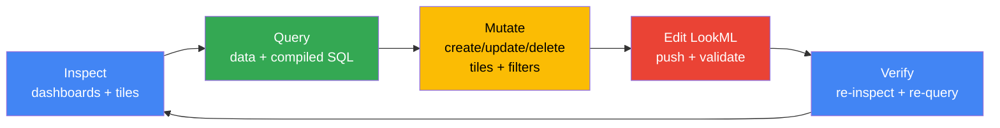
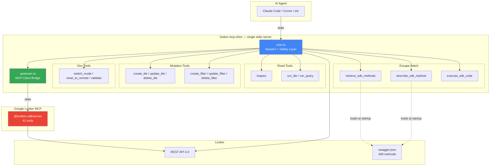
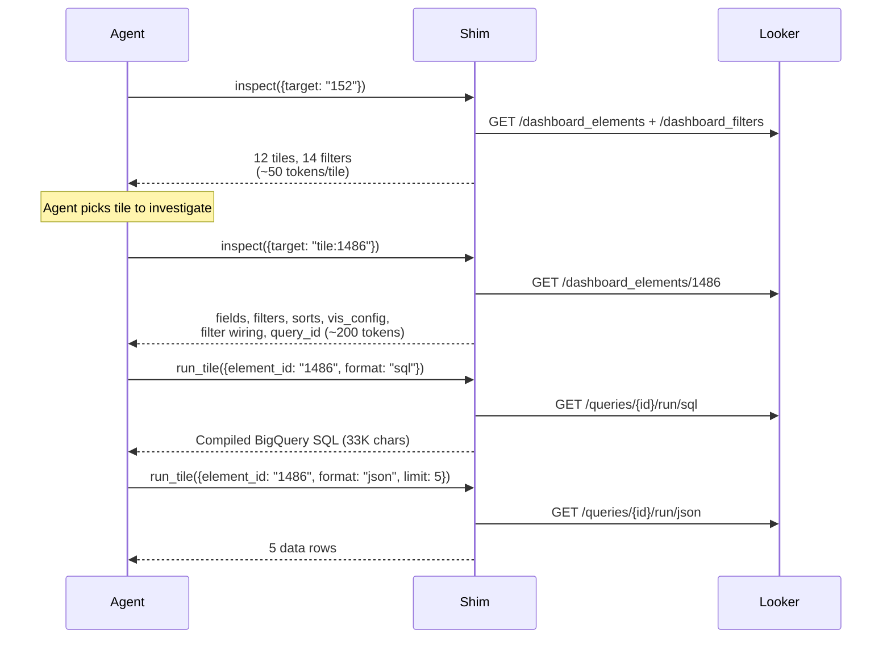
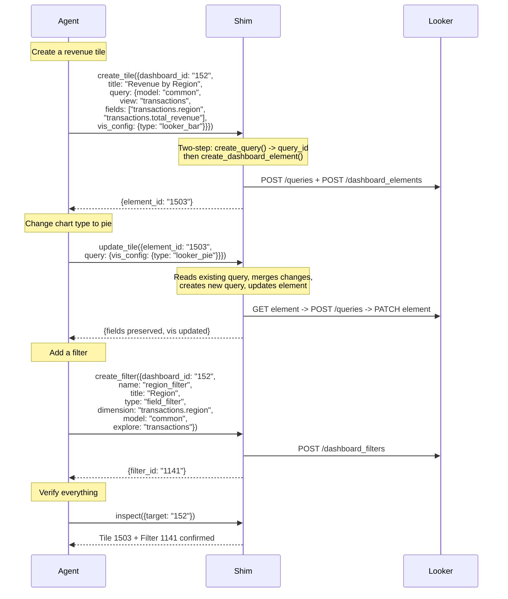
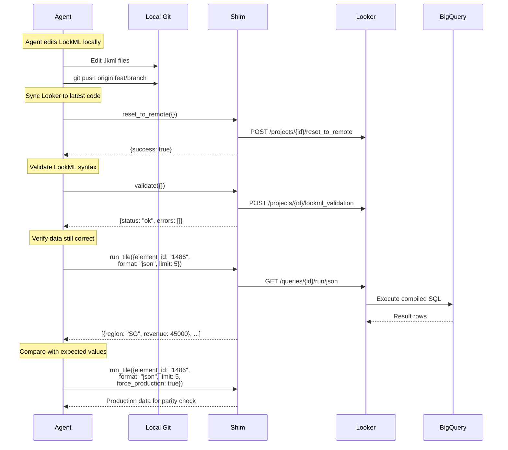
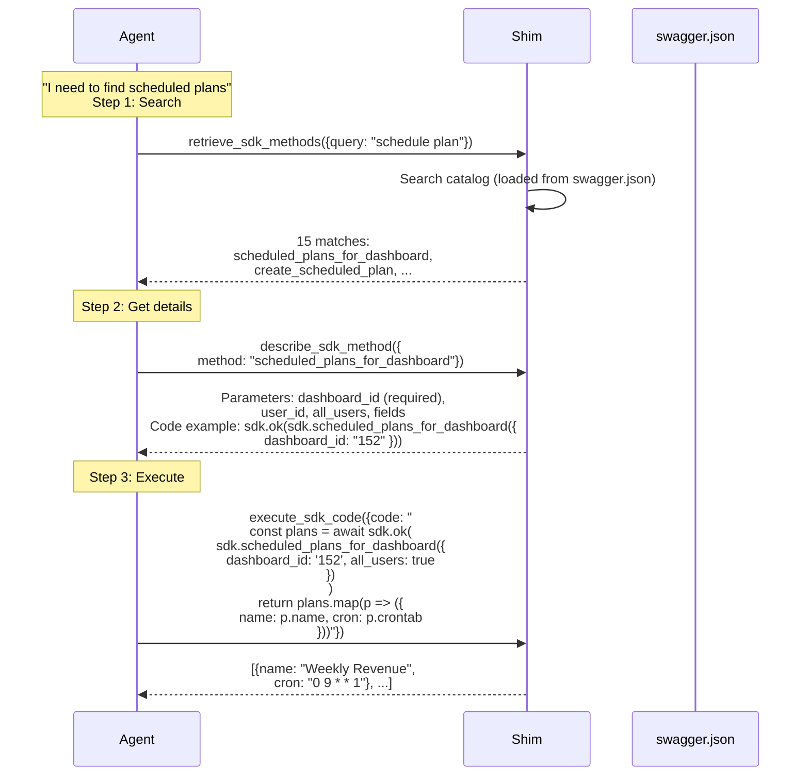
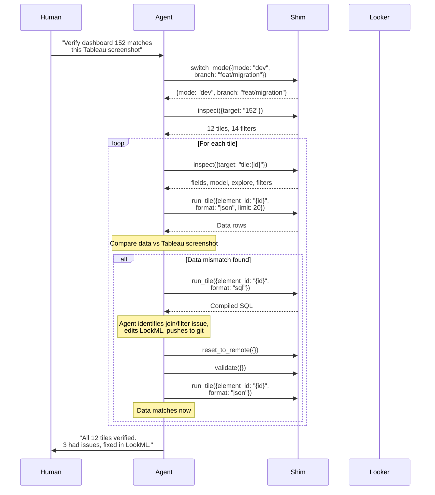

# @luutuankiet/looker-mcp-shim

**One MCP server. Full Looker developer autonomy for AI agents.**

Inspect dashboards tile-by-tile. Create, modify, and delete tiles and filters. Run queries with compiled SQL. Edit LookML, push, validate. Execute any of Looker's 469 API endpoints via SDK method discovery. All through a single stdio server — no human-in-the-loop for mechanical steps.

```bash
npx -y @luutuankiet/looker-mcp-shim
```

**Install skill docs** for Claude Code agents (workflow guides, API patterns, recipes):

```bash
npx -y @luutuankiet/looker-mcp-shim install-skill          # current project
npx -y @luutuankiet/looker-mcp-shim install-skill --global  # all projects
```

---

## What This Does

An AI agent using this server can do everything a Looker developer does:



**56 tools** from one server: 15 custom shim tools + 41 dynamically bridged from Google's upstream Looker MCP.

---

## Architecture



---

## Quickstart

### 1. Configure

```bash
# .env (or pass as env vars in MCP config)
LOOKER_BASE_URL=https://your-instance.cloud.looker.com
LOOKER_CLIENT_ID=your_client_id
LOOKER_CLIENT_SECRET=your_client_secret
LOOKER_PROJECT_ID=your-lookml-project
LOOKER_DEV_BRANCH=feat/your-branch
LOOKER_ALLOWED_BRANCHES=feat/your-branch
```

### 2. Register

**Claude Code / Cursor** — add to `.mcp.json`:

```json
{
  "mcpServers": {
    "looker": {
      "type": "stdio",
      "command": "npx",
      "args": ["-y", "@luutuankiet/looker-mcp-shim"],
      "env": {
        "LOOKER_BASE_URL": "https://your-instance.cloud.looker.com",
        "LOOKER_CLIENT_ID": "...",
        "LOOKER_CLIENT_SECRET": "...",
        "LOOKER_PROJECT_ID": "your-project",
        "LOOKER_DEV_BRANCH": "feat/your-branch",
        "LOOKER_ALLOWED_BRANCHES": "feat/your-branch"
      }
    }
  }
}
```

### 3. Test without registration

```bash
npx @luutuankiet/mcp-proxy-shim passthru -- npx @luutuankiet/looker-mcp-shim

# From another terminal:
curl http://localhost:3456/tools              # list all 56 tools
curl -X POST http://localhost:3456/call/inspect -d '{"args":{"target":"151"}}'
```

Disable upstream bridge: `SKIP_UPSTREAM=1 npx @luutuankiet/looker-mcp-shim`

### 4. Install Skill Docs (recommended)

```bash
npx -y @luutuankiet/looker-mcp-shim install-skill
```

Installs workflow guides to `.claude/skills/looker-mcp-shim/`:

| File | What It Teaches |
|------|----------------|
| `SKILL.md` | Entry point + tool index + decision tree |
| `rules/workflow.md` | The complete dev loop |
| `rules/inspect.md` | Dashboard/tile inspection |
| `rules/query.md` | Running queries with filter auto-wiring |
| `rules/mutate.md` | Tile + filter CRUD, filter wiring via SDK |
| `rules/git-ops.md` | Dev mode, git sync, LookML validation |
| `rules/sdk-escape.md` | SDK method discovery + code execution |
| `rules/patterns.md` | Migration QA, dashboard cloning, bulk ops |

Only touches `looker-mcp-shim/` namespace. No interference with other skills.

---

## Agent Workflows

### 1. Dashboard Inspection

The agent explores a dashboard in two levels — overview first, then drill into specific tiles.



**URL-smart input** — all of these work:

| Input | Parses To |
|-------|----------|
| `"152"` | Dashboard 152 |
| `"tile:1486"` | Tile detail |
| `"https://host/dashboards/152"` | Dashboard 152 |
| `"https://host/explore/common/transactions?fields=..."` | Explore |

---

### 2. Dashboard Mutation — Build & Modify Tiles

The agent creates tiles, modifies them, and verifies — full CRUD without touching the Looker UI.



**Key insight:** Looker's API rejects inline `query` objects on element create/update. The shim handles the two-step dance automatically — `create_query()` first, then reference via `query_id`. Agents don't need to know this.

**Partial updates:** When updating a tile's `vis_config`, the shim reads the existing query, merges your changes, and preserves everything else (fields, filters, sorts). You only send what changed.

---

### 3. LookML Edit → Validate → Verify Loop

The complete developer loop: edit LookML, sync Looker, validate, check results.



**`force_production`** — Run a query against production LookML from dev mode. Perfect for comparing dev changes against prod baseline without switching modes.

**Long-running queries** — Complex explores (e.g., BigQuery with 33K char compiled SQL) get 120s timeout by default. If that expires, the shim automatically falls back to Looker's async query task mechanism (same as the Looker UI), polls for completion, and returns results.

---

### 4. SDK Method Discovery — The Escape Hatch

For anything not covered by the 15 dedicated tools, the agent discovers and executes any of Looker's 469 API methods.



The catalog is loaded from the Looker instance's own `swagger.json` at startup — always accurate for your specific Looker version.

---

### 5. Migration QA — Tableau to Looker

The use case that drove this tool: an agent receives a Tableau screenshot and verifies data parity in Looker, tile by tile.



---

## Tool Reference

### Inspection

| Tool | What It Does | Key Args |
|------|-------------|----------|
| `inspect` | Dashboard overview or tile detail | `target`: URL, ID, or `tile:NNN` |

### Query Execution

| Tool | What It Does | Key Args |
|------|-------------|----------|
| `run_tile` | Execute a tile's query | `element_id`, `format` (json/sql/csv), `limit`, `force_production`, `timeout` |
| `run_query` | Ad-hoc explore query | `model`, `explore`, `fields`, `filters`, `sorts`, `limit`, `force_production`, `timeout` |

Both tools handle long-running BigQuery queries automatically — 120s timeout with async query task fallback.

### Dashboard Mutation

| Tool | What It Does | Key Args |
|------|-------------|----------|
| `create_tile` | Add tile to dashboard | `dashboard_id`, `title`, `query` (inline) or `query_id` |
| `update_tile` | Modify tile (partial) | `element_id`, `title`, `query` (partial merge) |
| `delete_tile` | Remove tile | `element_id` |
| `create_filter` | Add dashboard filter | `dashboard_id`, `name`, `title`, `type`, `dimension`, `model`, `explore` |
| `update_filter` | Modify filter | `filter_id`, `title`, `default_value`, ... |
| `delete_filter` | Remove filter | `filter_id` |

**Partial query updates:** `update_tile` merges your changes with the existing query. Send only what changed — fields, vis_config, sorts, and filters are preserved.

```json
{"element_id": "1486", "query": {"vis_config": {"type": "looker_pie"}}}
```

The shim reads the current query, merges your `vis_config` change, creates a new query, and updates the element. Fields, filters, sorts — all preserved.

### Dev Operations

| Tool | What It Does |
|------|-------------|
| `switch_mode` | Toggle dev/prod mode with branch selection |
| `reset_to_remote` | Sync Looker project to git HEAD |
| `validate` | LookML syntax validation with file:line errors |

### SDK Escape Hatch

| Tool | What It Does |
|------|-------------|
| `retrieve_sdk_methods` | Search 469 SDK methods by keyword/tag |
| `describe_sdk_method` | Get full params + code example for a method |
| `execute_sdk_code` | Run arbitrary SDK code with pre-authenticated session |

**Workflow:** Search -> Describe -> Execute. Never guess method signatures.

```
retrieve_sdk_methods({query: "render png"})        # find the method
describe_sdk_method({method: "create_dashboard_element_render_task"})  # get params
execute_sdk_code({code: "..."})                     # run it
```

### Upstream Looker MCP (41 tools, auto-bridged)

All tools from `@toolbox-sdk/server --prebuilt=looker,looker-dev` are automatically available:

`get_project_files`, `update_project_file`, `create_project_file`, `delete_project_file`, `get_explores`, `get_dimensions`, `get_measures`, `get_filters`, `get_models`, `get_connections`, `run_dashboard`, `run_look`, `query_sql`, `query`, `make_dashboard`, `make_look`, `dev_mode`, `validate_project`, `get_dashboards`, `get_looks`, and more.

These are prefixed with `[upstream]` in descriptions. Our shim tools take priority on name collisions.

---

## Safety Layer

### Blocked SDK Methods (hardcoded, non-configurable)

| Category | Methods |
|----------|--------|
| **Production deployment** | `deploy_ref_to_production`, `deploy_to_production` |
| **User impersonation** | `login_user` |
| **Destructive admin** | `delete_group`, `create_group`, `update_group`, `delete_user_attribute`, `delete_role`, `delete_folder`, `delete_dashboard`, `delete_look`, `update_user` |
| **Schedule manipulation** | `delete_scheduled_plan`, `update_scheduled_plan`, `create_scheduled_plan` |

### Configurable Guardrails

| Setting | Purpose |
|---------|--------|
| `LOOKER_ALLOWED_BRANCHES` | Branch allowlist for dev mode |
| `LOOKER_SANDBOX_FOLDER_ID` | Restrict dashboard saves to folder |

---

## Configuration

| Variable | Required | Default | Description |
|----------|----------|---------|------------|
| `LOOKER_BASE_URL` | **Yes** | — | Looker instance URL |
| `LOOKER_CLIENT_ID` | **Yes** | — | API client ID |
| `LOOKER_CLIENT_SECRET` | **Yes** | — | API client secret |
| `LOOKER_PROJECT_ID` | No | `''` | LookML project ID |
| `LOOKER_DEV_BRANCH` | No | `feat/dev_tools` | Default dev branch |
| `LOOKER_ALLOWED_BRANCHES` | No | `feat/dev_tools` | Comma-separated allowlist |
| `LOOKER_SANDBOX_FOLDER_ID` | No | — | Restrict saves to folder |
| `SKIP_UPSTREAM` | No | — | Set to `1` to disable upstream bridge |

---

## How It Compares

| Capability | Google Looker MCP | This Shim |
|-----------|------------------|----------|
| LookML file CRUD | \u2705 | \u2705 (via upstream bridge) |
| Run dashboard (full) | \u2705 | \u2705 (via upstream bridge) |
| Per-tile inspection | \u274c | \u2705 fields, filters, vis_config, filter wiring |
| Per-tile compiled SQL | \u274c | \u2705 run_tile format=sql |
| Create/update/delete tiles | \u274c | \u2705 with partial merge |
| Create/update/delete filters | \u274c | \u2705 |
| Reset to remote | \u274c | \u2705 |
| Dev/prod mode + branch | \u274c atomic | \u2705 atomic switch |
| SDK method discovery | \u274c | \u2705 retrieve + describe from swagger |
| Arbitrary SDK execution | \u274c | \u2705 with safety proxy |
| Long query handling | \u274c | \u2705 120s timeout + async fallback |
| **Total tools** | **41** | **56** (15 shim + 41 bridged) |

You only register one server. It bridges the upstream automatically.

---

## Tech Stack

| Component | Package | Purpose |
|-----------|---------|--------|
| Runtime | Node.js >=20 (ESM) | Modern JavaScript |
| Language | TypeScript ^5.7 | Type safety |
| Looker SDK | `@looker/sdk-node` | Auth, session, API |
| MCP Server | `@modelcontextprotocol/sdk` | Server + Client (for bridge) |
| Upstream | `@toolbox-sdk/server` | Google's Looker MCP (bridged) |
| Testing | `@luutuankiet/mcp-proxy-shim` | Passthru REST testing |

## License

MIT
