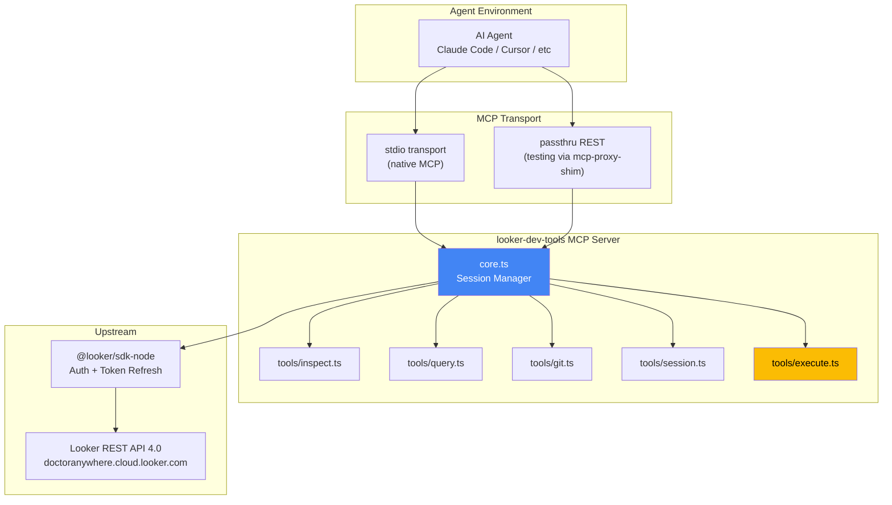
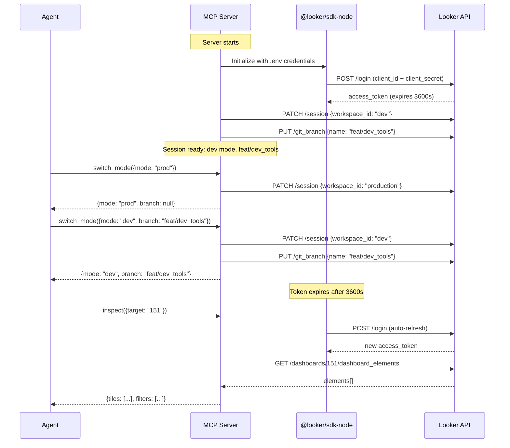
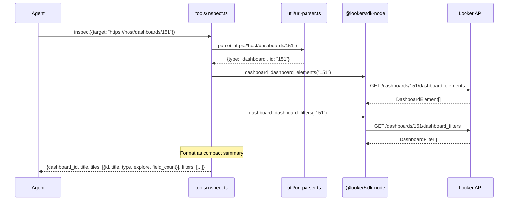

# Architecture

*Mapped: 2026-04-02, Updated: 2026-04-03*

## Project Structure Overview

```
looker-dev-tools/
├── src/
│   ├── index.ts              # Entry point — stdio + install-skill subcommand routing
│   ├── core.ts               # Session manager + safety: auth, branch gates, BLOCKED_METHODS
│   ├── upstream.ts           # MCP client bridge — spawns @toolbox-sdk/server, merges 41 tools
│   ├── install-skill.ts      # CLI: install skill docs to .claude/skills/looker-mcp-shim/
│   ├── tools/
│   │   ├── inspect.ts        # URL-smart two-level inspect with ordinal numbering
│   │   ├── query.ts          # run_tile (filter auto-wiring + natural refs) + run_query + async fallback
│   │   ├── dashboard.ts      # create/update/delete tile + filter (6 mutation tools)
│   │   ├── sdk-catalog.ts    # retrieve_sdk_methods + describe_sdk_method from swagger.json
│   │   ├── git.ts            # reset_to_remote (with RESET_BRANCHES gate), validate
│   │   ├── session.ts        # switch_mode (dev/prod, wildcard branch support)
│   │   └── execute.ts        # execute_sdk_code — escape hatch with retrieve/describe workflow
│   ├── util/
│   │   └── url-parser.ts     # Parse Looker URLs → structured targets
│   └── __test__/
│       ├── phase2.test.ts    # 10 tests: tile + filter CRUD on dashboard 151
│       └── stress.test.ts    # 29 tests: full e2e on dashboard 152
├── skills/looker-mcp-shim/   # Skill docs (ships with npm, installed via CLI)
│   ├── SKILL.md              # Entry point + tool index + decision tree
│   └── rules/                # 7 workflow guides (inspect, query, mutate, git-ops, etc.)
├── package.json              # v0.3.3, bin: looker-mcp-shim + install-skill
├── tsconfig.json
├── .env.example
├── gsd-lite/                 # Project management artifacts
└── remote_looker_bitbucket/   # Cloned Bitbucket repo + worktrees
    ├── da-data-looker/        # Main clone
    ├── feat__dev_tools/       # Git worktree
    └── tmp__unified_users/    # Sandbox worktree for e2e testing
```

| Directory/File | Purpose |
|----------------|--------|
| `src/index.ts` | Entry point — MCP stdio server + install-skill subcommand |
| `src/core.ts` | Session lifecycle: auth, dev/prod, branch gates (ALLOWED + RESET), safety proxy |
| `src/upstream.ts` | MCP client bridge — spawns upstream server, discovers tools, routes calls |
| `src/tools/query.ts` | run_tile (filter auto-wiring + tile resolution) + run_query (async fallback) |
| `src/tools/dashboard.ts` | 6 mutation tools: create/update/delete tile + filter |
| `src/tools/sdk-catalog.ts` | Method discovery from live swagger.json (469 methods) |
| `skills/looker-mcp-shim/` | Skill docs for zero-context agents (installed via CLI) |

## Tech Stack

| Component | Package | Version | Purpose |
|-----------|---------|---------|--------|
| **Runtime** | Node.js | >=20 (ESM) | Same as mcp-proxy-shim |
| **Language** | TypeScript | ^5.7 | Type safety for SDK and MCP |
| **Looker SDK** | `@looker/sdk-node` | ^26.x | Auth, session management, API methods |
| **Looker types** | `@looker/sdk` | ^26.x | TypeScript types for API responses |
| **MCP Server** | `@modelcontextprotocol/sdk` | ^1.12.x | MCP server framework (Server, transports) |
| **Testing** | `@luutuankiet/mcp-proxy-shim` | ^1.2.x | Passthru mode for zero-registration testing |

## Data Flow

### MCP Server → Looker API



### Session Lifecycle



### Tool Call Flow (inspect example)



## Entry Points

| File | Start here to understand... |
|------|----------------------------|
| `src/core.ts` | Session management — auth, dev/prod toggle, token refresh, branch switching |
| `src/tools/inspect.ts` | URL parsing + two-level dashboard/tile inspection |
| `src/tools/execute.ts` | Code execution escape hatch — how arbitrary SDK code runs |
| `src/util/url-parser.ts` | How Looker URLs are parsed into structured targets |
| `swagger.json` | Full Looker API 4.0 spec — the reference for `execute_sdk_code` |

## Key Design Decisions

| Decision | Rationale |
|----------|----------|
| MCP server, not CLI | Persistent session (dev mode survives across calls), native tool I/O, zero stdout parsing |
| Dev mode default, prod mode available | Safe default for migration work, but agent needs prod inspection for parity checks |
| `@looker/sdk-node` for auth only, thin wrappers for tools | SDK handles token refresh and session; our tools control output format and token efficiency |
| Dashboard filter auto-wiring | run_tile reads filter_wiring + dashboard defaults, injects into query. Agents don't need Looker domain knowledge |
| Two-step query creation | Looker API rejects inline query on element create/update. Shim does create_query → query_id automatically |
| Separate branch gates | ALLOWED_BRANCHES (* ok) for switching. RESET_BRANCHES (explicit only) for reset_to_remote. Switching is safe, resetting is destructive |
| Upstream bridge via MCP client | Spawns @toolbox-sdk/server as child process, connects via StdioClientTransport, merges tools. If unavailable, shim tools work independently |
| SDK catalog from live swagger | Loads /api/4.0/swagger.json at startup. Always version-accurate. Agent workflow: retrieve → describe → execute |
| Skill docs ship with package | Installed via CLI to .claude/skills/. Namespace isolation — only touches looker-mcp-shim/ |
| URL-smart `inspect` input | Agents think in URLs (from browser, from docs). Parsing is mechanical, saves agent effort |
| Two-level inspection | Dashboard overview is cheap (~50 tokens/tile), tile detail is medium (~200 tokens). Agent controls depth |
| Code execution escape hatch | 200+ API endpoints exist. Wrapping 10 covers 80%. Execute covers the other 20%. Future-proof |
| Passthru testing before registration | Zero-config iteration. Prove each tool works via REST before touching proxy config |
| Session state in MCP server process | MCP server is long-lived (conversation lifetime). Session state = process state. No external persistence needed |
| Follows mcp-proxy-shim pattern | Same TypeScript stack, same entry point routing, same MCP SDK. Proven architecture |

## API Endpoints Used

| Endpoint | Method | Used By | Purpose |
|----------|--------|---------|--------|
| `/login` | POST | core.ts | Get access_token |
| `/session` | PATCH | session.ts | Toggle dev/prod mode |
| `/projects/{id}/git_branch` | PUT | session.ts | Switch branch |
| `/projects/{id}/reset_to_remote` | POST | git.ts | Sync Looker to Bitbucket |
| `/projects/{id}/lookml_validation` | POST | git.ts | LookML syntax check |
| `/dashboards/{id}/dashboard_elements` | GET | inspect.ts | All tiles for a dashboard |
| `/dashboards/{id}/dashboard_filters` | GET | inspect.ts | All filters for a dashboard |
| `/dashboard_elements/{id}` | GET | inspect.ts | Single tile detail |
| `/queries/{id}/run/{format}` | GET | query.ts | Run existing query (tile data/SQL) |
| `/queries/run/{format}` | POST | query.ts | Run inline query (ad-hoc) |
| `/projects/{id}/files/{path}` | GET | files.ts | Read LookML file |
| `/projects/{id}/files/{path}` | PATCH | files.ts | Write LookML file |
| `/render_tasks/dashboard_elements/{id}/{fmt}` | POST | execute.ts | Render tile as PNG (via SDK escape) |
| `/dashboard_elements/{id}` | PATCH | dashboard.ts | Update tile |
| `/dashboard_elements` | POST | dashboard.ts | Create tile |
| `/dashboard_elements/{id}` | DELETE | dashboard.ts | Delete tile |
| `/dashboard_filters` | POST | dashboard.ts | Create filter |
| `/dashboard_filters/{id}` | PATCH | dashboard.ts | Update filter |
| `/dashboard_filters/{id}` | DELETE | dashboard.ts | Delete filter |
| `/queries` | POST | dashboard.ts, query.ts | Create query (two-step for element create/update) |
| `/queries/run/{format}` | POST | query.ts | Run inline query (with filter auto-wiring) |
| `/query_tasks` | POST | query.ts | Create async query task (timeout fallback) |
| `/query_tasks/{id}` | GET | query.ts | Poll async task status |
| `/query_tasks/{id}/results` | GET | query.ts | Get async task results |
| `/api/4.0/swagger.json` | GET | sdk-catalog.ts | Load SDK method catalog (no auth needed) |

## Looker Dev Mode Implementation Notes

**Dev mode is a session-level state, not a project-level state.** Each API session (access_token) has its own workspace context.

| Aspect | Detail |
|--------|--------|
| **Toggle** | `PATCH /session` with `{workspace_id: "dev"}` or `{workspace_id: "production"}` |
| **Persistence** | Mode persists for the session lifetime (until token expires or explicit switch) |
| **Branch** | In dev mode, must also set branch via `PUT /projects/{id}/git_branch` |
| **Queries** | Queries in dev mode run against dev LookML. Use `force_production: true` param to query prod LookML from dev session |
| **File reads** | `GET /projects/{id}/files/{path}` returns dev branch content when in dev mode |
| **Validation** | `POST /lookml_validation` validates dev branch LookML when in dev mode |
| **Reset** | `POST /reset_to_remote` only works in dev mode — destroys uncommitted changes, syncs to remote HEAD |

**Critical for `execute_sdk_code`:** The tool description must always include current mode (dev/prod) and branch, so the agent knows what context their code executes in.
