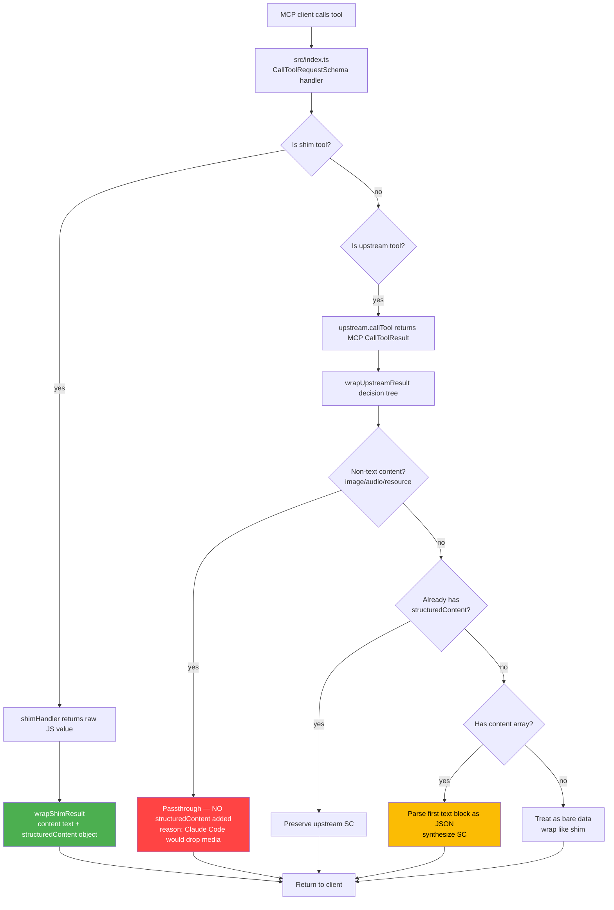

# v0.4.4 — structuredContent for Shim and Upstream Bridged Tools

**Released:** 2026-04-11
**Type:** Feature (backward-compatible)
**Audience:** Agents and clients that consume `@luutuankiet/looker-mcp-shim` over MCP — especially Claude Code and anything built on MCP 2025-03-26+

---

## TL;DR

Through v0.4.3, every tool in this package returned its result as a single text block — just `{ content: [{ type: 'text', text: '...' }] }` with no machine-parseable companion. Clients had to `JSON.parse(response.content[0].text)` every time, paying for serialization round-trips and occasionally tripping on edge cases (bare strings, numbers, null payloads).

v0.4.4 adds `structuredContent` to every tool response, aligning with MCP 2025-03-26+ spec. Both the 17 hand-rolled shim tools AND the 41 upstream-bridged `@toolbox-sdk/server` tools now return a parsed JSON object alongside the text. Clients that support structuredContent (Claude Code, among others) skip the parse step entirely. Clients that don't keep getting the text content they always did. Zero breakage.

No new tools, no new input shapes, no new configuration. Every existing call gets a richer response. This is a pure protocol-adherence upgrade.

---

## Why This Release Exists

MCP's 2025-03-26 revision introduced `structuredContent` as a first-class field on `CallToolResult` — a JSON object the server can include alongside (or instead of) the text content array. It exists so that machine-readable tool output doesn't have to round-trip through text serialization.

When a client prefers `structuredContent` (Claude Code does, and others will follow), and the server ships it, the client gets the data as a parsed object directly. When the server doesn't, the client either falls back to parsing `content[0].text` or gives up and treats the response as opaque text. Guess which produces better agent behavior on structured data?

The proof was sitting in the sister project `@luutuankiet/mcp-proxy-shim`, which adopted this pattern in v1.5.0 (see `releases/v1.5.0.md` there). Every tool call through that shim now ships structuredContent — including upstream-bridged tools that the shim wraps with `unwrapAndRewrap`. Agents measurably stopped mis-parsing large grep results and bulk file reads.

`looker-mcp-shim` faces the same problem at higher volume: inspect calls return dashboard metadata (fields, filters, sorts), run_tile returns query results (BigQuery rows + compiled SQL), execute_sdk_code returns arbitrary JSON from the Looker SDK. Every one of those was getting serialized to a text string and handed to the client, hoping the client would parse it correctly.

v0.4.4 fixes that. Ship-shape.

---

## Highlights

| Change | What it does | Why it matters |
|---|---|---|
| **New `src/util/mcp-result.ts` helper** | Exports `toStructuredContent`, `hasNonTextContent`, `extractUpstreamSC`, `wrapShimResult`, `wrapUpstreamResult` | Single source of truth for result-wrapping logic. All tool returns flow through here. |
| **`wrapShimResult(rawData)`** | Wraps a shim handler's raw JS return value into `{ content, structuredContent }` | 17 shim tools now return parsed objects natively. No per-tool edits — wrapping happens centrally in `src/index.ts`. |
| **`wrapUpstreamResult(upstreamResult)`** | Handles upstream bridge results with a 4-case decision tree (see below) | 41 bridged `@toolbox-sdk/server` tools get structuredContent even though the upstream may not provide it |
| **`hasNonTextContent` guard** | Detects image/audio/resource blocks and skips SC in that case | Prevents Claude Code from silently dropping media when it prefers structuredContent over content array |
| **Upstream SC preservation** | Prefers upstream's own structuredContent when present (e.g., from 2025-03-26+ compliant servers) | We don't overwrite perfectly good upstream SC with our synthesis |
| **39 unit tests, zero runtime deps** | `src/__test__/mcp-result.test.mjs` runs against compiled dist/ with no Looker API calls | Pure-function coverage of all decision-tree branches — run in CI or locally with `node src/__test__/mcp-result.test.mjs` |

---

## How It Works



The `wrapUpstreamResult` decision tree is the interesting part. Upstream MCP servers sit at a wide spectrum of spec compliance:

| Upstream age | What they return | Our handling |
|---|---|---|
| 2025-03-26+ compliant | `{ content: [...], structuredContent: {...}, isError?: ... }` | Preserve their SC, preserve their content (Case 2) |
| 2024-11 era | `{ content: [{ type: 'text', text: '{"...":...}' }] }` | Parse the first text block as JSON, synthesize SC (Case 3) |
| Multimodal (image/audio) | `{ content: [{ type: 'image', data: 'base64', mimeType: '...' }] }` | Passthrough — do NOT add SC (Case 1, critical safety) |
| Bare primitive wrapper | `42` / `"message"` / `null` | Wrap like a shim result (Case 4) |

Case 1 is the important one. Without the `hasNonTextContent` guard, a client that prefers structuredContent (Claude Code does) would SILENTLY DROP the image bytes and display "[object Object]" instead of the picture. This exact bug is called out in `mcp-proxy-shim` core.ts comments (lines 630-632) and we inherit the same guard verbatim.

---

## Before / After

### Before (v0.4.3)

Agent calls `inspect({ target: "151" })` via MCP:

```json
{
  "content": [
    {
      "type": "text",
      "text": "{\"dashboard_id\":\"151\",\"title\":\"Revenue Dashboard\",\"tiles\":[{\"id\":\"1477\",\"title\":\"Revenue by Type\",\"type\":\"looker_grid\"},{\"id\":\"1478\",\"title\":\"Revenue by Country\",\"type\":\"looker_map\"}]}"
    }
  ]
}
```

Client must:
1. Extract `response.content[0].text`
2. Call `JSON.parse()` on it
3. Handle parse errors if the text is truncated or malformed
4. Access `parsed.tiles[0].id`

Three indirections, one possible parse error. For upstream bridged tools that return large payloads (entire dashboard element lists from `@toolbox-sdk/server`), the parse step was a non-trivial cost.

### After (v0.4.4)

Same call, same agent, same tool. Response now:

```json
{
  "content": [
    {
      "type": "text",
      "text": "{\n  \"dashboard_id\": \"151\",\n  \"title\": \"Revenue Dashboard\",\n  \"tiles\": [\n    { \"id\": \"1477\", \"title\": \"Revenue by Type\", \"type\": \"looker_grid\" },\n    { \"id\": \"1478\", \"title\": \"Revenue by Country\", \"type\": \"looker_map\" }\n  ]\n}"
    }
  ],
  "structuredContent": {
    "dashboard_id": "151",
    "title": "Revenue Dashboard",
    "tiles": [
      { "id": "1477", "title": "Revenue by Type", "type": "looker_grid" },
      { "id": "1478", "title": "Revenue by Country", "type": "looker_map" }
    ]
  }
}
```

Client that supports structuredContent accesses `response.structuredContent.tiles[0].id` directly. Client that doesn't still gets the pretty-printed JSON text (now with 2-space indent for human readability, a minor improvement).

Zero breakage. The `content[0].text` IS the JSON-pretty text of the same object that's in `structuredContent`. Any client that was parsing text will keep doing so and get the same data.

---

## What's Covered (Surface Audit)

### Shim tools (17 total, all wrapped via `wrapShimResult`)

| Category | Tools |
|---|---|
| Session | `switch_mode` |
| Git ops | `reset_to_remote`, `validate` |
| Inspect | `inspect` |
| Query | `run_tile`, `run_query` |
| Dashboard mutations | `create_tile`, `update_tile`, `delete_tile`, `create_filter`, `update_filter`, `delete_filter` |
| SDK escape hatch | `retrieve_sdk_methods`, `describe_sdk_method`, `execute_sdk_code` |
| LookML dashboard | `inspect_lookml_dashboard`, `import_lookml_dashboard`, `export_dashboard_lookml` |

### Upstream bridged tools (41, all wrapped via `wrapUpstreamResult`)

All tools prefixed with `[upstream]` from `@toolbox-sdk/server --prebuilt=looker,looker-dev` — including `run_dashboard`, `query_sql`, `make_dashboard`, `validate_project`, `get_dashboards`, `get_looks`, `run_look`, and the rest. Each one now ships structuredContent even though `@toolbox-sdk/server` itself does not (tested against v1.x of the toolbox as of 2026-04-11).

### Error paths (intentionally NOT wrapped)

Errors still return plain text content with `isError: true` — no structuredContent. This matches the mcp-proxy-shim convention and avoids structuring error surfaces that agents treat as unstructured prose.

---

## Configuration

Zero new env vars, flags, or config keys. The wrapping is uniform and always-on.

| Surface | Change |
|---|---|
| `package.json` | Version `0.4.3` → `0.4.4`, no dep changes |
| `src/util/mcp-result.ts` | NEW — 166 lines, pure functions, no runtime deps |
| `src/__test__/mcp-result.test.mjs` | NEW — 236 lines, 39 tests, runs against `dist/` |
| `src/index.ts` | 3 patches: 1 import + 2 router return swaps |
| Tool modules (`src/tools/*.ts`) | NO CHANGES — handlers still return raw data, wrapping happens centrally |
| `src/core.ts`, `src/upstream.ts` | NO CHANGES |

---

## Upgrade Notes

- **No breaking changes.** Clients that only consume `content[0].text` keep working unchanged — the text is still there, now with 2-space indent for easier eyeballing.
- **Clients that already preferred structuredContent** will get machine-parsed data without needing fallback logic. Claude Code is the notable example; check your client docs for others.
- **Upstream bridged tools get structuredContent for free.** If `@toolbox-sdk/server` or any future upstream adds native structuredContent, we preserve it (Case 2 of the decision tree). No version coordination needed.
- **Image and audio outputs are safe.** The `hasNonTextContent` guard prevents Claude Code from dropping media blocks — if any Looker tool ever returns an image (e.g., render_tile via `execute_sdk_code`), it passes through untouched.
- **Testing.** Run `node src/__test__/mcp-result.test.mjs` after any change to the helper — 39 pure-function tests cover all branches of the decision tree. No Looker credentials required.

---

## Files Changed

- `src/util/mcp-result.ts` — NEW helper module (166 lines)
- `src/__test__/mcp-result.test.mjs` — NEW unit test (236 lines, 39 assertions)
- `src/index.ts` — Import helpers + swap two return statements in CallToolRequestSchema handler (~10 lines net change)
- `package.json` — Version bump `0.4.3` → `0.4.4`

See full diff: [`v0.4.3...v0.4.4`](https://github.com/luutuankiet/looker-mcp-shim/compare/v0.4.3...v0.4.4)

---

## Design Notes and Hard Truths

**Why the helper return types are `any`, not `CallToolResult`.** The MCP SDK (1.28+) turned `CallToolResult` into a discriminated union that includes an async task variant. TypeScript narrow-matching on that union at the `setRequestHandler` call site was producing `Property 'task' is missing` errors no matter what local interface we declared. Importing the SDK's own `CallToolResult` type didn't help because its strict `ContentBlock` union conflicted with the loose passthrough shapes we build for upstream responses.

After three build attempts, we chose pragmatism: helper functions return `any`, and runtime correctness is proven by 39 unit tests covering every branch of the decision tree. The alternative — type-puzzling against the SDK's internal discriminated union — would have burned a half-day for zero user-visible benefit.

**Why shim tools were trivial but upstream was hard.** Shim tools already returned raw JS values (objects, arrays, strings). Wrapping them was a one-liner: `const text = JSON.stringify(rawData); return { content: [...], structuredContent: rawData }`. Upstream was harder because the upstream response could be in any of four shapes, and one of those shapes (non-text content blocks) is a silent-corruption trap if you blindly add structuredContent. The `hasNonTextContent` guard is the single most important line in the helper.

**Why we didn't add `outputSchema` declarations.** MCP 2025-03-26+ also introduced optional `outputSchema` on tool definitions — a JSON Schema that clients can validate structuredContent against. We intentionally did NOT add these for the 17 shim tools because: (a) drafting schemas for nested Looker API shapes is a significant undertaking, (b) `mcp-proxy-shim` v1.5.0 didn't add outputSchemas either and works fine, (c) the runtime wrapping is the core value — schema docs can follow in a later release without blocking the protocol upgrade.

This release ships protocol adherence at the wire level. Schema documentation at the type level is the next milestone if there's demand.

---

Thanks to `@luutuankiet/mcp-proxy-shim` v1.5.0 for proving the pattern first — every helper here is an adapted port of `toStructuredContent`, `hasNonTextContent`, `extractUpstreamSC`, and `unwrapAndRewrap` from its `src/core.ts`. Imitation, flattery, etc.
