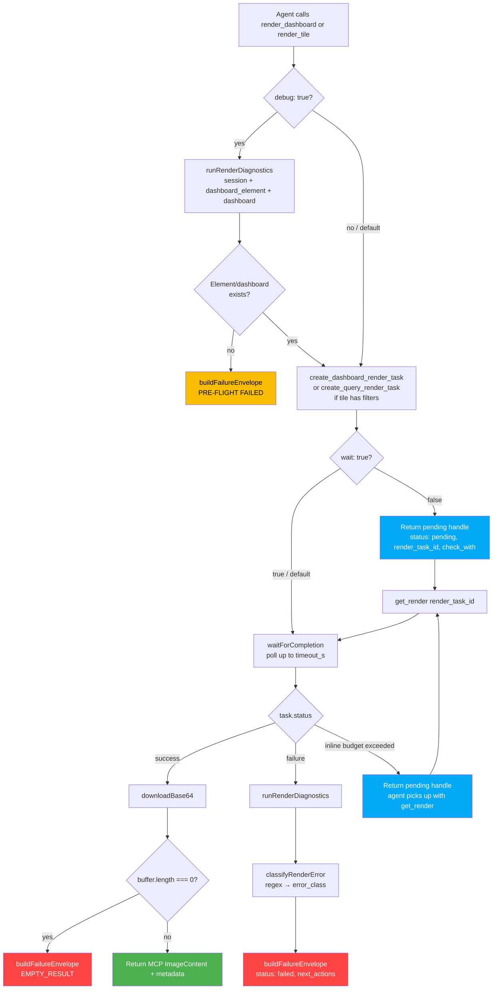

# v0.5.0 — Visual Preview: Render Dashboards and Tiles with Debug Envelopes

**Released:** 2026-04-13
**Type:** Feature (backward-compatible, new tools)
**Audience:** Agents iterating on LookML through an inspect → render → critique → edit → re-render loop. Also: any client that wants image-first output from Looker's RenderTask API without juggling base64 manually.

---

## TL;DR

Three new tools that let the agent SEE a Looker dashboard or tile as an image it can inspect with vision: `render_dashboard`, `render_tile`, and `get_render`. Images come back as first-class MCP ImageContent — no disk staging, no file-path handoff. Medium detail tier (~1024×768, ~60% lighter on vision tokens than a 1280×800 default) is the default; `low` (~640×400) is for rapid edit-render loop iteration; `high` (~1920×1080) is for sign-off.

Render errors no longer dump raw minified Looker stack traces at the agent. Failures return a structured envelope with a classified `error_class`, a curated `likely_cause`, and an actionable `next_actions[]` list — the agent knows what to try next without reading chunked JS files. The nasty class `ANGULAR_RUNTIME_EXCEPTION` (Looker's headless Chromium crashing on stale vis cache or missing data) now comes with an explicit workaround: "retry with a filters string — routes through create_query_render_task and bypasses the element render crash path."

Opt-in `debug: true` runs a cheap pre-flight (dashboard/element exists? workspace? has base query?) before attempting the render and fails fast with the same envelope if the target is fundamentally broken. Failure diagnostics run always on error paths — the agent needs context the moment things go wrong, not only when it remembered to ask.

---

## Why This Release Exists

v0.4.x was about inspection and mutation — read dashboards, query tiles, create filters, edit LookML. What it couldn't do was let the agent SEE what it had built. A LookML change looks clean in the diff, passes validation, and the agent has no way to know whether the chart looks right. Filter state is invisible. Spacing is invisible. Color choices are invisible. The agent is coding a frontend by feel.

Looker ships a `RenderTask` API that generates PNGs of dashboards and tiles. It's been there since v21. The obvious fit for a tight edit → render → critique loop. The obvious trap: polling is slow, filters don't work on the native tile render, failures dump multi-kilobyte stack traces from Looker's headless Chromium, and token economics on 1280×800 PNGs are brutal if you're burning the loop a hundred times per session.

v0.5.0 turns it into something the agent can actually lean on:

- **Detail tiers** (`low` / `medium` / `high`) with tuned pixel counts. Medium is ~60% lighter on vision tokens than the previous default. Low is fast enough to burn 50 times in a row. High is for final review.
- **Async flow + graceful inline degrade.** Default behavior polls inline up to `timeout_s` and returns the image when it's ready (fast path, zero round-trip). If the render overruns, it returns the same `{status: pending, render_task_id, check_with}` handle the async path uses, and the agent picks it up later with `get_render`. Inline-fast / async-fallback hybrid without forcing the agent to choose up front.
- **Filter support on tiles.** Looker's native `create_dashboard_element_render_task` has no filter parameter in the SDK. So when filters are passed to `render_tile`, the shim routes through `create_query_render_task`: fetch the element's base query, merge dashboard filter defaults with user-provided values, translate display names to dimensions via the dashboard filter map, build a new query, render that. No-filter calls still take the fast element path.
- **Structured failure envelopes with classification.** A regex-table classifier maps Looker `status_detail` strings to error classes (`ANGULAR_RUNTIME_EXCEPTION`, `NO_BASE_QUERY`, `EMPTY_RESULT`, `QUERY_TIMEOUT`, `VALIDATION_ERROR`, `MODEL_NOT_FOUND`, `PERMISSION`, `UNKNOWN`). Each class carries a curated cause explanation and a list of specific next actions. Failure diagnostics run always — cheap non-throwing SDK probes return workspace, element_found, has_base_query, dashboard_found, force_production_retry_available. The envelope shape is the agent contract: look at the envelope, pick an action, move on.
- **Opt-in pre-flight.** `debug: true` on `render_dashboard` or `render_tile` runs diagnostics BEFORE the render attempt and fails fast with the same envelope if the target is missing. Saves a full render round trip when the target is bad.

Image stays first-class MCP ImageContent throughout. No disk staging in the shim itself. Native MCP clients (Claude Code, TUI) consume the ImageContent block directly. REST/daemon callers who need a file path get automatic disk-write fallback from `@luutuankiet/mcp-proxy-shim`'s daemon — that's a compatibility shim, not a required step.

---

## Highlights

| Change | What it does | Why it matters |
|---|---|---|
| **New `render_dashboard` tool** | Render a Looker dashboard as PNG (first-class MCP ImageContent). Detail tiers, async/sync hybrid, filter support via `dashboard_filters`, theme passthrough. | Agent can see the dashboard it built. No more coding the frontend blind. |
| **New `render_tile` tool** | Same for a single element. Filter support routes through the query render task when filters are present. | Tight edit → render → critique loop on a specific tile. |
| **New `get_render` tool** | Poll a pending `render_task_id` from the async flow. Returns the image when ready, a pending status otherwise, or a failure envelope on error. | Async handoff for long-running renders without blocking the MCP call. |
| **Detail tiers** (`low` / `medium` / `high`) | Fixed width/height per tool type. Medium default, explicit width/height still override. | ~60% vision-token savings over previous defaults. Low tier fast enough for rapid iteration. |
| **Graceful inline degrade** | `wait: true` tries inline up to `timeout_s`. Overruns return a pending handle instead of erroring — no forced async/sync choice up front. | Zero round-trip for fast renders, automatic fallback for slow ones. |
| **Filter-aware tile rendering** | `render_tile` with filters builds a fresh query and renders it. Display-name → dimension translation via the dashboard filter map. | The native element render task cannot accept filters at all. This sidesteps the SDK gap and, as a side effect, bypasses certain known Looker Angular crash paths on demo instances. |
| **Structured failure envelopes** | Every render error returns `{status: 'failed', error_class, likely_cause, next_actions[], diagnostics?, raw_status_detail, render_task_id}` with `isError: true` | Agent gets a classified error + concrete next steps instead of a minified stack trace. |
| **Pre-flight `debug: true`** | Runs dashboard/element/session SDK probes BEFORE render, fails fast if target is missing/unrenderable | Saves a 10-20s render round trip on bad targets. Optional — failure diagnostics run always. |
| **Always-on failure diagnostics** | Any failure path triggers `runRenderDiagnostics()` — cheap SDK calls returning workspace, element_found, has_base_query, dashboard_found | Agent gets context the moment things go wrong, not only when it remembered to ask. |

---

## How the Render Flow Works



Three paths converge on the same image result (fast inline, async handoff, `get_render` pickup). Three paths converge on the same failure envelope (pre-flight, post-render failure, empty result). The agent sees a consistent wire shape regardless of which path hit.

---

## Error Classification

The classifier is a regex table in `src/tools/render-debug.ts`. Each pattern match yields an error class with a curated cause and a list of specific next actions.

| Class | Match patterns | Likely cause | Top next action |
|---|---|---|---|
| `ANGULAR_RUNTIME_EXCEPTION` | `ANGULAR_RUNTIME_EXCEPTION`, `chunk.js:N:M`, `Cannot read properties of undefined` | Headless Chromium crashed — usually stale vis cache, broken vis_config, or a d3 scale crash on missing data | Retry `render_tile` with a filters string — routes through query render path and bypasses the element render crash entirely |
| `NO_BASE_QUERY` | `has no base query`, `no base query` | Text/markdown/button tile, or LookML-defined tile with empty `result_maker` | Use `render_dashboard` to see the tile in context; not renderable standalone |
| `EMPTY_RESULT` | `produced empty`, `empty result`, `0 bytes` | Render succeeded but payload is 0 bytes — underlying query returned no rows | Run `run_tile` to verify `row_count > 0`; widen filter range |
| `MODEL_NOT_FOUND` | `model.*not.*found`, `no such model` | LookML model missing or mis-named on current branch | Run `validate` for LookML errors; check branch with `switch_mode` |
| `VALIDATION_ERROR` | `validation failed`, `syntax error` | LookML validation failing; render can't compile | Run `validate({project})` for file:line errors |
| `QUERY_TIMEOUT` | `timeout`, `timed out`, `query took too long` | Underlying query exceeded render time budget | Lower `detail` tier or narrow filters; submit with `wait: false` for async |
| `PERMISSION` | `403`, `forbidden`, `not authorized` | SDK credentials lack render permission | Verify `.env` `LOOKER_CLIENT_ID`/`SECRET`; confirm the role has `render` permission |
| `UNKNOWN` | fallback | Unrecognized — see `raw_status_detail` | Retry with `debug: true` for a pre-flight health check |

Adding a new class is a single-line addition to the `PATTERNS` table. No changes needed in `render.ts`.

---

## Before / After

### Before

Agent calls `render_tile` on a tile that triggers the headless Chromium Angular crash. The tool throws:

```
Error: Render failed: ANGULAR_RUNTIME_EXCEPTION {"exception":{"message":"Cannot read properties
of undefined (reading 'location')","stack":"TypeError: Cannot read properties of undefined
(reading 'location')\n    at H (https://static-a.lookercdn.com/.../chunk.js:2:85039)\n    at ee
(https://static-b.lookercdn.com/.../chunk.js:1:57086)\n    at ii (...)\n    at Ql (...)\n    at
Os (...)\n    at Ts (...)\n    at As (...)\n    ...25 more lines..."}} (after 12s)
```

Raw minified stack trace. No error class. No cause. No recovery path. The agent either stalls, escalates, or starts guessing.

### After

Same call, same tile:

```json
{
  "status": "failed",
  "error_class": "ANGULAR_RUNTIME_EXCEPTION",
  "message": "Render failed: ANGULAR_RUNTIME_EXCEPTION {...} (after 12s)",
  "likely_cause": "Looker's headless Chromium crashed while rendering the element — usually a stale vis cache, a broken vis_config, or a d3 scale crash on missing/malformed data in the underlying query.",
  "next_actions": [
    "Retry render_tile with a filters string — routes through create_query_render_task and bypasses the element render crash path entirely",
    "Use inspect({url: tile_url_or_element_id}) to check vis_config and measures for stale fields",
    "Switch to production or a fresh dev branch via switch_mode — the crash may be dev-branch state",
    "If the crash affects every tile on an instance, it is a server-side Looker bug (e.g. demo-data instance) and cannot be fixed in the shim"
  ],
  "raw_status_detail": "ANGULAR_RUNTIME_EXCEPTION {...full original string preserved for debug...}",
  "render_task_id": "c39440c7ab...",
  "diagnostics": {
    "workspace": "dev",
    "element_found": true,
    "element_title": "Sales Overview",
    "has_base_query": true,
    "query_id": 5821,
    "model": "retail",
    "explore": "sales",
    "dashboard_found": true,
    "dashboard_title": "Weekly Review",
    "force_production_retry_available": true
  }
}
```

The agent reads `error_class: ANGULAR_RUNTIME_EXCEPTION`, follows `next_actions[0]`, retries with filters, gets an image back via the query render path. Loop continues. No escalation, no stall.

---

## Configuration

| Surface | Change |
|---|---|
| `package.json` | Version `0.4.5` → `0.5.0`, no dep changes |
| `src/tools/render.ts` | NEW — 613 lines. Three tool definitions, helper functions (`resolveDetail`, `resolveTimeout`, `waitForCompletion`, `downloadBase64`, `buildImageResult`, `buildPendingResult`, `buildFailureResult`, `mergeTileFilters`), and the handler dispatch. |
| `src/tools/render-debug.ts` | NEW — 275 lines. Error classifier (`classifyRenderError`), diagnostics runner (`runRenderDiagnostics`), envelope builders (`buildFailureEnvelope`, `preflightEnvelope`). Pure helpers, takes `sdk: any`, easy to unit-test in isolation. |
| `src/index.ts` | No changes — `findShimHandler` auto-discovered the three new tools. |
| Tool surface | 19 shim → 20 shim (`get_render` is new). Total 20 shim + 45 upstream = 65. |

---

## Upgrade Notes

- **No breaking changes.** Existing tools unchanged. The three new tools are additive.
- **New `isError: true` flag on failure envelopes.** Clients that branch on `isError` will see it on render failures; clients that ignore it still get the JSON envelope as text content.
- **Image return is first-class MCP ImageContent.** Clients that support the block (Claude Code, TUI, anything on MCP 2024-11+) consume it directly. REST/curl clients hitting the shim through `@luutuankiet/mcp-proxy-shim` daemon get automatic disk-write fallback — same contract as v0.4.x images.
- **Failure diagnostics are always-on.** If you wrap render calls in your own error handling, note that failure responses now carry a `diagnostics` object with workspace + element/dashboard metadata. No action needed unless you want to surface those fields.
- **`debug: true` is opt-in.** Existing calls without the flag behave exactly as before (with the addition of failure envelopes on error paths).
- **Metadata shape for success responses is unchanged** — `render_task_id`, `filters_applied`, `render_path`, `size_bytes`, `rendered_at` are all still there in the JSON text block alongside the image.

### Recommended loop pattern

```ts
// Tight iteration loop on a specific tile
async function iterateTile(elementId: string) {
  while (true) {
    const result = await call('render_tile', {
      element_id: elementId,
      detail: 'low',          // fast iteration tier
      debug: true,            // pre-flight catches bad targets
      timeout_s: 20,          // shorter budget for loop mode
    })

    if (result.isError) {
      // envelope shape: error_class, next_actions[]
      const envelope = JSON.parse(result.content[0].text)
      if (envelope.error_class === 'ANGULAR_RUNTIME_EXCEPTION') {
        // Retry per next_actions[0] — route through query render path
        return call('render_tile', { element_id: elementId, filters: 'Status=Active', detail: 'low' })
      }
      // handle other classes or escalate
      throw new Error(envelope.message)
    }

    // critique, edit LookML, re-render
    const critique = await visionCritique(result.content[0].data)
    if (critique.isGood) return result
    await editLookML(critique.suggestions)
  }
}

// Final review at high detail
const finalImage = await call('render_dashboard', {
  dashboard_id: '151',
  detail: 'high',   // 1920×1080, full chart fidelity
})
```

---

## Files Changed

- `src/tools/render.ts` — NEW, 613 lines. Three tool definitions + handler logic.
- `src/tools/render-debug.ts` — NEW, 275 lines. Classifier + diagnostics + envelope builders.
- `package.json` — Version `0.4.5` → `0.5.0`.
- `releases/v0.5.0.md` — This file.
- `releases/README.md` — Index entry.

See full diff: [`v0.4.5...v0.5.0`](https://github.com/luutuankiet/looker-mcp-shim/compare/v0.4.5...v0.5.0)

---

## Design Notes and Hard Truths

**Image as first-class MCP return, not disk staging.** An advisor subagent recommended writing PNGs to `/tmp/mcp-images/` and returning file paths. The arguments were clean: no base64 on the wire, stable content-addressed caching, prompt cache hits. The arguments didn't survive contact with reality: `fs-mcp`'s `read_files` tool also returns MCP ImageContent (base64 over wire), so the net bytes are unchanged — you just pay the serialization at read time instead of render time. Content-addressed caching requires hash-based filenames, which is a separate feature that would need implementing. Native MCP clients (Claude Code) consume ImageContent blocks directly. Putting disk staging in the shim reproduces work that `@luutuankiet/mcp-proxy-shim`'s daemon already does conditionally for REST/curl clients. The decision was to keep image return first-class and let the daemon handle compatibility for non-native clients. If content-addressed caching lands as a future optimization, it can add hash-based filenames in the daemon without changing the shim's wire contract.

**Why the element render path has no filter parameter.** Confirmed by grepping `node_modules/@looker/sdk/lib/4.0/methods.d.ts` — `create_dashboard_element_render_task(elementId, resultFormat, width, height, fit)` has no filter slot. The dashboard render path does (`dashboard_filters` in the request body). So when filters are passed to `render_tile`, the shim has to route through `create_query_render_task`: fetch the element's base query, merge dashboard filter defaults into user filters, translate display names to dimensions, build a new query, render that. The extra SDK calls are the cost; the payoff is that filters actually work on tiles. The no-filter path still takes the fast native element route.

**Why failure diagnostics are always-on, not gated by `debug`.** The original sketch had `debug: true` controlling both pre-flight AND failure diagnostics. The actual design split them: pre-flight is opt-in (costs a few SDK calls before every render), failure diagnostics are always-on (only fire when something broke, and the agent needs context the moment things go wrong). Gating failure context behind a flag the agent forgot to pass defeats the purpose.

**Why there's no standalone `diagnose_render` tool.** An early sketch considered shipping a separate `diagnose_render({dashboard_id | element_id})` tool that runs the battery of checks without attempting a render. The always-on failure diagnostics + opt-in pre-flight cover the same ground without adding tool surface. If a separate tool becomes necessary later (e.g., to run checks on a tile you don't intend to render), it can wrap `runRenderDiagnostics()` directly — the helper is exported.

**What's still deferred.** Content-addressed caching (hash the render params into the task ID). Diff mode (render two states side-by-side). Chrome auto-crop (strip header/footer chrome, keep filter bar). Tile error banner extraction (when Looker renders a tile with a red error box, pull the text into metadata instead of making the agent OCR it). Row counts in metadata. Font substitution surfacing. Unit test harness for the error classifier against synthetic `status_detail` strings. None of these block the MVP; all are tracked in the internal work log.

**Verifier subagent.** A fresh Explore-type subagent was spawned per the project's handoff-loop protocol to independently verify the implementation against a live passthru server. It re-ran typecheck, unit tests, and four end-to-end tool calls (dashboard happy path, Angular error classification, filter render path, pre-flight on a missing dashboard), and confirmed all seven claims with VERDICT: PASS. Second time the handoff-loop verifier contract has produced clean results on a mid-to-large feature — the pattern is paying for itself.

---

v0.5.0 ships the visual-preview surface with the sharp edges blunted: detail tiers for token economics, async hybrid for responsiveness, filter support for useful tile renders, and structured envelopes with classifier-driven next actions for recoverable failure handling. The edit-render-critique loop was the goal. This release makes it practical.
