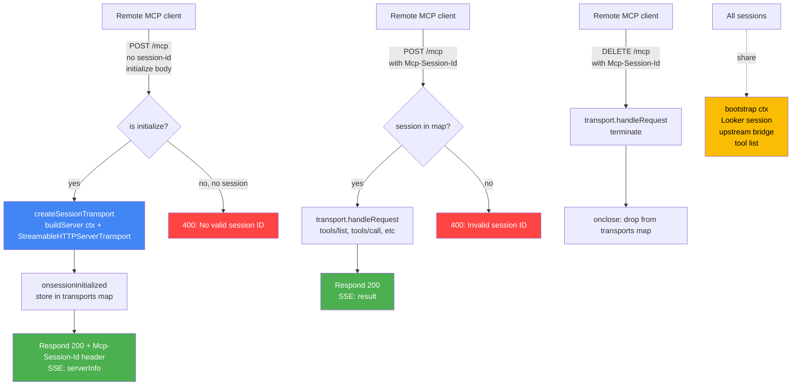

# v0.6.0 — HTTP Streamable Transport: Remote Agents Without a Sidecar

**Released:** 2026-05-27
**Type:** Feature (backward-compatible, new subcommand)
**Audience:** Anyone running this server for remote agents — over a LAN, behind a reverse proxy, on a dev box that Claude Code on another machine wants to reach. Also anyone who has been wrapping the stdio binary in `mcp-proxy-shim passthru` just to expose an HTTP surface.

---

## TL;DR

A new subcommand: `looker-mcp-shim serve`. Same tool surface (20 shim + 41 upstream bridged), exposed natively over HTTP Streamable on `POST/GET/DELETE /mcp` with session-id multiplexing. Stdio is still the default, unchanged. Each downstream client session gets its own MCP `Server` instance; Looker auth and the upstream `@toolbox-sdk/server` child process are process-level singletons — one node multiplexes many remote clients without duplicating the expensive bits. `/health` endpoint, CORS headers, optional `MCP_APIKEY` query-param gate, graceful shutdown wired through SIGINT/SIGTERM.

No behavior change for existing stdio users. No new dependencies — `StreamableHTTPServerTransport` was already in `@modelcontextprotocol/sdk` 1.12+.

---

## Why This Release Exists

v0.5.x and prior could only be reached as a stdio child process. That works for local MCP clients (Claude Code, Cursor) running on the same box, but anything remote needed a sidecar — typically `npx @luutuankiet/mcp-proxy-shim passthru -- npx @luutuankiet/looker-mcp-shim` to turn stdio into a REST surface, then another hop to wrap that into HTTP Streamable. Two processes, two log streams, two restart cycles. The passthru pattern was good for ad-hoc testing; it was never the answer for "point a remote MCP client at this URL."

The MCP SDK ships `StreamableHTTPServerTransport` directly. The reference implementation is right next door in `mcp-proxy-shim`'s `http-server.ts` — the same session-id-keyed map, the same `isInitializeRequest` gate on first POST, the same SSE-framed response. The cost to wire it natively was almost entirely a refactor: split process-level state (one Looker session, one upstream bridge, one tool list) from per-connection state (one MCP `Server` instance per session), then point the new HTTP entrypoint at both. The split is the part that pays forward — a future SSE or websocket transport is one new file, not another `index.ts` rewrite.

The production deployment shape is unchanged from what `mcp-proxy-shim` taught: bind to `127.0.0.1` by default, put Caddy or nginx in front for TLS and auth, expose `https://looker-shim.yourdomain.com/mcp` to remote agents. For dev boxes on a trusted LAN, `HOST=0.0.0.0 MCP_APIKEY=...` is one env-var flip away. The shim does not try to be a TLS terminator or an OAuth server; those belong upstream.

---

## Highlights

| Change | What it does | Why it matters |
|---|---|---|
| **New `serve` subcommand** | `looker-mcp-shim serve` starts a Node `http` server on `PORT` (default 3000) bound to `HOST` (default `127.0.0.1`), exposing the MCP server at `POST/GET/DELETE /mcp`. | Remote MCP clients can connect directly. No passthru sidecar required. |
| **Session-id multiplexing** | Each downstream client gets a fresh `MCP.Server` + `StreamableHTTPServerTransport` pair, keyed by an `Mcp-Session-Id` header issued on the initialize POST. | Many simultaneous remote agents, one node process. |
| **Shared process-level state** | Looker auth (one login + token refresh loop) and the upstream `@toolbox-sdk/server` child process are bootstrapped once per node, not per session. | One Looker session, one upstream bridge, many downstream clients. |
| **`/health` endpoint** | `GET /health` returns `{status, sessions, tools, uptime}` as JSON. | Reverse-proxy health checks; cheap liveness probe. |
| **Optional `MCP_APIKEY` gate** | When set, requests must include `?apikey=KEY` on `/mcp`. Unauthorized requests return 401 with a JSON-RPC error envelope before any session handling. | Public-LAN deployments without a fronting auth proxy can still gate access. Unset = open (intended for localhost or proxy-fronted setups). |
| **CORS headers** | Permissive default (`*` origin, `Mcp-Session-Id` exposed, `Last-Event-ID` allowed). | Browser-based MCP clients work out of the box; tighten via reverse proxy if needed. |
| **Graceful shutdown** | SIGINT/SIGTERM closes all active session transports, then the upstream bridge, then the HTTP server. 5s hard-kill backstop. | Clean restarts under systemd / Docker / Kubernetes. |
| **Subcommand router** | `looker-mcp-shim` (stdio, default) / `looker-mcp-shim serve` (HTTP) / `looker-mcp-shim install-skill` / `looker-mcp-shim --help`. | One binary, multiple modes. |
| **Architecture split** | New `src/server-factory.ts` exposes `bootstrap()` (process-level singletons) and `buildServer(ctx)` (per-connection MCP `Server`). Both transports import it. | Future transports (SSE, websocket) are additive; no entrypoint churn. |

---

## Request Flow



One Looker session, one upstream bridge, many downstream MCP sessions. The split between `bootstrap()` and `buildServer()` is exactly that boundary.

---

## Before / After

### Before

Exposing the server to a remote agent meant chaining processes:

```bash
# Box A: the looker-mcp-shim host
npx @luutuankiet/mcp-proxy-shim passthru -- npx @luutuankiet/looker-mcp-shim
# REST surface on http://localhost:3456 — not MCP Streamable

# Box B: another wrapper to expose HTTP Streamable
# (or accept that the only consumer pattern is local curl, not native MCP clients)
```

Two processes, REST not MCP, no session multiplexing, no `Mcp-Session-Id` semantics.

### After

```bash
PORT=3000 MCP_APIKEY=your-secret looker-mcp-shim serve
# listening on http://127.0.0.1:3000/mcp
# health check:  http://127.0.0.1:3000/health
```

Remote client config:

```json
{
  "mcpServers": {
    "looker": {
      "type": "http",
      "url": "http://your-host:3000/mcp?apikey=your-secret"
    }
  }
}
```

Native MCP Streamable. One process. Session-id multiplexing built into the SDK transport. Clean shutdown on SIGTERM.

---

## Configuration

| Surface | Change |
|---|---|
| `package.json` | Version `0.5.0` → `0.6.0`, no dep changes |
| `src/server-factory.ts` | NEW — 173 lines. `bootstrap()` returns `{session, upstream, allToolDefs, upstreamToolNames}` once per process. `buildServer(ctx)` returns a fresh `MCP.Server` with `ListTools` and `CallTool` handlers wired. Called once for stdio, per-session for HTTP. |
| `src/http-transport.ts` | NEW — 228 lines. `startHttp()` builds the Node `http` server, mounts `/mcp` and `/health`, manages the `transports` map keyed by session id, wires CORS, the `MCP_APIKEY` gate, and graceful shutdown. |
| `src/index.ts` | Rewritten as a subcommand router. Default path still calls `bootstrap()` + `buildServer()` and connects `StdioServerTransport` — identical externally to v0.5.x. `serve` dynamically imports `http-transport`. `--help` is new. |
| `README.md` | New section under Quickstart: "Run as HTTP server (remote agents)." Tech-stack row updated. |
| Tool surface | Unchanged. 20 shim + 41 upstream bridged = same 61 tools across both transports. |

### Environment variables (serve only)

| Var | Default | Purpose |
|---|---|---|
| `PORT` | `3000` | Port to listen on |
| `HOST` | `127.0.0.1` | Bind address. Set `0.0.0.0` for LAN/public exposure |
| `MCP_APIKEY` | (unset) | When set, requests must include `?apikey=KEY` on `/mcp` |

All other env vars (`LOOKER_BASE_URL`, `LOOKER_CLIENT_ID`, `LOOKER_CLIENT_SECRET`, `LOOKER_PROJECT_ID`, `LOOKER_ALLOWED_BRANCHES`, `LOOKER_RESET_BRANCHES`, `SKIP_UPSTREAM`) apply equally to stdio and HTTP modes.

---

## Upgrade Notes

- **No breaking changes.** Stdio mode (default subcommand) behaves identically to v0.5.x.
- **Adopting HTTP is opt-in** — add the `serve` arg to your launcher and point your MCP client at the URL. Existing `.mcp.json` entries with `"type": "stdio"` keep working as-is.
- **Production deployments** should bind to `127.0.0.1` (default) and put Caddy / nginx in front for TLS + auth, or set `MCP_APIKEY` for a built-in query-param gate. Avoid `HOST=0.0.0.0` without one of those.
- **Health checks**: point your reverse proxy or orchestrator at `GET /health`. Returns 200 with `{status:"ok", sessions, tools, uptime}` whenever the node is alive; no auth required.
- **Session lifetime**: a downstream session lives until the client calls `DELETE /mcp` or the connection drops. The server-side `onclose` handler removes it from the map. Don't expect long-lived sessions to survive a process restart — reconnect logic on the client side handles it.
- **API-key rotation**: `MCP_APIKEY` is read at startup. Rotating means a restart. If that's painful, front the server with a reverse proxy that handles auth and leave `MCP_APIKEY` unset.

---

## Files Changed

- `src/server-factory.ts` — NEW, 173 lines. Process-level bootstrap + per-connection Server factory.
- `src/http-transport.ts` — NEW, 228 lines. HTTP Streamable transport entrypoint.
- `src/index.ts` — Rewritten as subcommand router. Stdio path preserved.
- `package.json` — Version `0.5.0` → `0.6.0`.
- `README.md` — New HTTP section under Quickstart, updated tagline + tech stack.
- `releases/v0.6.0.md` — This file.
- `releases/README.md` — Index entry.

See full diff: [`v0.5.0...v0.6.0`](https://github.com/luutuankiet/looker-mcp-shim/compare/v0.5.0...v0.6.0)

---

## Design Notes

**Why a subcommand and not a flag.** `looker-mcp-shim --http` was the alternative. Subcommand won because it lets `--help` documentation differentiate cleanly (`stdio` env vars vs `serve` env vars) and matches the existing `install-skill` precedent. Flags reading as "mode switches" tend to grow into a tangle; subcommands stay clean.

**Why bind `127.0.0.1` by default, not `0.0.0.0`.** Dev boxes get scanned. Binding loopback by default means a fresh `looker-mcp-shim serve` is never accidentally a public endpoint. The reference repo `mcp-proxy-shim` defaults to `0.0.0.0`; this server inherits the Looker credentials in its environment, which is a stricter blast radius. One env-var flip away when you want LAN exposure.

**Why one MCP `Server` per session, not one shared.** The MCP SDK's `Server` is stateful per-connection (initialize state, capability negotiation). Sharing one across sessions would require manual session-keying inside every handler. The SDK's `StreamableHTTPServerTransport` already does the session multiplexing; pairing each transport with a fresh `Server` keeps the handler code identical to stdio. The expensive state (Looker auth, upstream bridge, tool list) lives in the `ServerContext` and is shared by closure capture, which is the cheap part.

**Why dynamic-import `http-transport` from `index.ts`.** Stdio is the dominant case; loading the HTTP server module + its `node:http` + SDK HTTP exports adds ~30ms of cold-start overhead that stdio users don't need. `await import('./http-transport.js')` defers it to the `serve` branch only.

**Modeled on `mcp-proxy-shim`'s `http-server.ts`.** The session-id map, CORS header set, SSE 400 messages, and DELETE-as-termination semantics are lifted verbatim. The MCP spec leaves a lot of detail to implementations; copying a working one is cheaper than re-deriving the same answers.

**What's deferred.** SSE legacy endpoint (some older MCP clients want `/sse` not `/mcp`). Per-session API keys (current gate is one shared key). Rate limiting (front with a proxy if needed). Structured access logs (currently console.error "session initialized" lines — fine for the use case, not fine for a 100-tenant deployment). Metrics/Prometheus endpoint. None of these block the MVP; each is a small additive change against the new transport seam.

---

v0.6.0 makes the server reachable from anywhere a URL can reach. Stdio stays the local default; HTTP Streamable is one subcommand away when the agent isn't local. The architecture split that made it possible is the part that compounds — transports are now a swappable layer, not a rewrite trigger.
